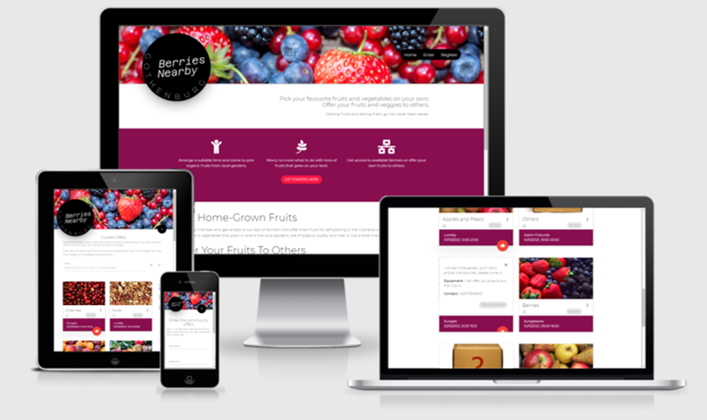

# Berries Nearby

A website dedicated to a community of people who want to help each other out with consumation of fruits and vegetables. There are two main groups of users of this page: people - "farmers" - who own gardens where there has grown too many fruits and vegetables (for short I will be using "fruits" only but it is meant both) and the farmers want to offer these fruits to anyone who is interested. The fruits would otherwise just stay on trees left for birds or just to rott. 
Second group of website users are people who are interested in self picking these fruits. Together they create a community of people who help each other out - one with offers, other with taking care of the offer. 
The website is closed for public, everybody who wants to join in has to provide basic data and log into the page. The area of gardens and self picking is limited to a specific location, in our case it is the town of Gothenburg in Sweden and its surrounding areas. 
When logged in, every user has the chance to see other people offers and at the same time post an advertisement - offer himself. There is no need to post an advertisement to see the offers.
The website community owners take no responsibility for the physical interaction between the people, although bad behaviour may be reported. The community also takes no responsibility for quality of fruits offered.

This project is fictional only. The idea came from seeing actual people putting small papers of invitation for picking berries and fruits, or simply leaving baskets full of fruits in front of their gardens.

### Project Construction:
This application contains the key CRUD requirement functionalities. Data handling document is database based on MongoDB. Functionality is created using Flask, HTML5, CSS and JavaScript. Materialize framework was used in building fronted structure to make sure app is responsive as possible and can be used on multiple screen sizes.

Application offer a registration and login system with password hashing to protect each user. Logged user can browse offers created by other registered users and create, update and delete offers created by him/her.

## UX
The web has been been built to provide simple yet clear information to all users. As mentioned above, there are mainly two groups of users: farmers, who offer their fruits, and customers, who come and get the fruits from farmers. 
### User stories:
1. **Farmer**
    - I am a person who owns a big garden, have a lot of fruits and don't know what to do with them. Therefore I want to offer these fruits to other people, someone who would come and get the fruits themselves. 
    a) I may be offering to pick fruits completely (physically pick the fruits up from trees)
    b) I may have already picked the fruits and offer them prepared in baskets, boxes, etc.
    - the farmer has the option to offer fruits for free or for a certain price (price is limited up to 1000SEK)

    - Goal of a farmer to visit the website: 
        - open website, check the current offers, add a new offer with description what I offer
        - second and third time visit: check or edit my own offer, check my profile page with possible reports from other users, delete offer in case it is no longer available.
        - checking the website and contacts for community administrators in order to contact them via email
        - farmer may also visit the webpage in order to get more information about the project or get contact information to community administrators/managers via email or social media. 

2. **Customer**
    - I am interested in getting home-grown fruits, I am ready to make some work in order to receive that.

    - Goal of a farmer to visit the website: 
        - open website and check the available offers, possibly pick an offer I am intersted at, and note down (separately, not yet within the current app) contacts for farmer in order to contact him when pick up
        - reporting an offer that I have been in touch with for faulty information or any possible disruptive behaviour
        - checking the website and contacts for community administrators in order to contact them via email
        - customer may also visit the webpage in order to get more information about the project or get contact information to community administrators/managers via email or social media. 

3. **Admin**
    - Currently the admin has limited rights to work with the website, many of them left for future development. 
    - Admin's role is apart from the two above enriched with possibilities to: 
        - add, edit or delete fruit categories
        - check reports of fruits 
        - sending automatic warning to farmers in order to inform them about the need of editing their offer
        - editing offers of others
        - delete other offers

    - Goal of Admin to visit the website: 
        - as a general user, Admin may be interested in the presented offers, therefore it is reckoned Admin may be checking the offers as any other user. As is Admin's role defined, he would visit the website in order to perform his administration role: check any new reports, send warnings to farmers, edit offers of others if necessary, delete offers of others if necessary. Admin can also add a new fruit category if one is currently sought after or he/she may delete a category if it is not popular at all. 

4. **First time visitor**
    - Anybody who has heard about the project, is interested about getting to know more or is considering joining the community. First time visitor has limited access into the website and can view only the home page, registration page or sign in page (for those who have already registered earlier.)

### Design of the website:
Design has been chosen to be aligned with the topic of fruits and berries. Overall design is based on warm colors and images of fruits, it is a rather "simple" design that is meant to evoke imaginations of fruit tastes and coziness with family and friends.

#### Typography
- For all texts on website has been chosen font 'Montserrat' that is light and modern. The purpose is to evoke dynamic atmosphere. 
- Logo and text "Berries Nearby" is written with font 'Azeret Mono ExtraLight' although the logo itself has been inserted as an image to simplify it's usage. Text 'Gothenburg' on logo is written with 'Montserrat ExtraLight'.
- All fonts come from [Google Fonts](https://fonts.google.com/ "Google Fonts").

#### Colors
- There are 4 main colors used in the general user view, one extra is linked for Admin and his/hers roles, colors are using Materialize color palette:
    - #880e4f pink darken-4
    - #3f51b5 indigo
    - #000000 black
    - #ffffff white
    - #009688 teal - for Admin roles

- The colors has been devided accordingly: 
    - The project uses two main colors for its branding: #880e4f (pink darken-4 by Materialize) and #000000 (black). These two colors together with #ffffff (white) are meant to be the representative colors.
    - When entering the website (signing in) the colors has been devided as: 
        - #880e4f pink darken-4 - for action where there is "a change" such "submit", "edit offer" etc. 
            - #e91e63 pink is used for font in Flash messages announcing change
        - #3f51b5 indigo - for action where it is confirmation of the actual statement or canceling changes, indigo color is meant to be "stable" color
        - #009688 teal - Admin has been assigned an extra color in order to assure the actions he/she is doing are visible only for Admin role.

- The website is using images with a lot of red and purple colors in order to bring in the feeling of "juice" and food tastes

#### Imagery
Images on website are to be found under these links (all have been dowloaded from [Shutterstock](https://www.shutterstock.com/).)
- [Main Berries image](https://www.shutterstock.com/cs/image-photo/berries-variety-background-strawberries-currants-blueberries-514087786)
- [Home page parallax scroll image](https://www.shutterstock.com/cs/image-photo/summer-fruit-berry-assortment-flatlay-strawberries-1488978506)
- Images of fruits on Offers.html
    - [Apples and Pears](https://www.shutterstock.com/cs/image-photo/apples-pears-63252076)
    - [Apricots, nectarines](https://www.shutterstock.com/cs/image-photo/pile-colorful-summer-fruits-apricots-nectarines-90071506)
    - [Cherries](https://www.shutterstock.com/cs/image-photo/red-cherries-pile-ripe-stalks-1703667262)
    - [Berries](https://www.shutterstock.com/cs/image-photo/woven-basket-red-strawberries-green-leafy-1930097360)
    - [Vegetables](https://www.shutterstock.com/cs/image-photo/assortment-fresh-vegetables-carrot-garlic-kohlrabi-429138103)
    - [Nuts](https://www.shutterstock.com/cs/image-photo/different-nuts-heap-1210210198)
    - [Others](https://www.shutterstock.com/cs/image-photo/box-unknown-contents-no-image-product-731673463)
- [Manage Categories](https://www.shutterstock.com/cs/image-photo/berries-on-wooden-rustic-background-253899859)

#### Wireframes
- [Home 1](static/wireframes-mockup/home1.png)
- [Home 2](static/wireframes-mockup/home2.png)
- [Register](static/wireframes-mockup/register.png)
- [Sign In](static/wireframes-mockup/signIn.png)
- [Profile](static/wireframes-mockup/profile.png)
- [Offers 1](static/wireframes-mockup/offers1.png)
- [Offers 2](static/wireframes-mockup/offers2.png)
- [Add Offer](static/wireframes-mockup/add_offer.png)
- [Edit Offer](static/wireframes-mockup/edit_offer.png)
- [Offers - Admin View](static/wireframes-mockup/offers_admin.png)
- [Manage Categories - Admin View](static/wireframes-mockup/manage_categories_admin.png)
- [Add Category - Admin View](static/wireframes-mockup/add_category_admin.png)
- [Reports - Admin View](static/wireframes-mockup/reports_admin.png)
- [Report's Detail - Admin View](static/wireframes-mockup/reports_detail_admin.png)

#### Mockup - main page
- [Mockup of Home Page](static/wireframes-mockup/mockup-berries-nearby.png)

## Features

### Existing Features

- **Home - home.html** 
    - Introduces the community project with motivational and marketing quotes
    - Navigation menu displays three links only: 
        1. Home - goes back to home.html
        2. Enter - link to signin.html
        3. Register - link to register.html
    
    - Purple area with motivational text suggests "Get started now" with a link to register.html
    - Footer to present links to email and to social media - external resources of information about the project(fictional) and Copyright (fictional)

- **Enter - signin.html** - for already registered users, page provides simple form to write in username and password in order to enter the page. 
For users who accidentaly open the page and do not have an account yet is placed a link below the form to "register.html."

- **Register - register.html** - for user who have not yet registered into the website, page provides a form where user writes in some essential personal information in order to be able to use the website. These information could be possibly used by Admin in later conversation. 
For users who accidentaly open the page and already have en existing account, a link below the form gets the user to "signin.html."

- once a regular user (not Admin) is logged in, the navigation changes and provides different links: 
    1. **Current Offers**
    2. **Add Offer**
    3. **Profile**
    4. **Sign Out**

- Admin sees another one(two according to size screens) links to: 
    
    **Large screens**:
    
    5. **Admin Editor**
        - **Manage Categories**
        - **Reports**
    
    **Small Screen devices**
    - two links are presented directly in the mobile navbar
        - **Manage Categories**
        - **Reports**

1. **Current Offers - offers.html**
    - User sees the list of current offers that are available. Each offer is presented in a card with a reveal function to show more information. 
    - Each card present (without needing to click on anything) basic information: 
        - Fruit category
        - Username of the person, who is offering
        - Image of fruits (to be replaced by a real image of fruits later, see Features left to implement)
        - Location of pick up
        - Date and time of pick up
        - A possibility to report the offer in case user finds any information falsy
        - A badge if offer is free of charge (if charge is requested badge is hidden)
    
    - On click, each card with the offer reveals more detailed information: 
        - Description of the current offer
        - Equipment needed for the pick up
        - Contact information 
        - Price - in case offer is not for free
        - Offer created by - once again username of the person presenting the offer (for providing better user friendly experience)

    - For Admin and for offers that are "mine" - each offer that belongs to the currently signed in user, each card additionally provides the option to: 
        - Edit offer - link leads to edit_offer.html
        - Delete offer - click opens a modal with verification for delete of offer, on click "delete" this offer is deleted from database. Modal also offers the option of "Cancel" where the user goes afterwards to offers.html
        - Offer created by is automaticaly marked in indigo color as "My Offer"
    
    - At the bottom page displays Footer - presented above on Home.html

2. **Add Offer - add_offer.html**
    - Form where a new offer can be inserted. 
    - Requested fields: 
        - Select category of your fruits (select input)
            - list of available fruits is rendered from MongoDB
        - Where can we find you (select input)
            - list of locations is rendered from MongoDB
        - Date available for pick up (date picker)
        - Time available - START (time picker)
        - Time available - END (time picker)
        - Description - Anything you want to let people know. (input, on purpose it is not a textarea as the design of Materialize is not as pleasant)
        - Equipment (input, on purpose it is not a textarea as the design of Materialize is not as pleasant)
        - Contact (input, on purpose it is not a textarea as the design of Materialize is not as pleasant)
    
    - Not requested fields
        - Free of Price - switch - on/off
        - Price SEK/kg
            - These price fields are not "requested" as there is a condition either price free or the user inserts their own price. For cases users ignore these fields there is an automatic amount of 0 that appears on the offer and badge "Free of charge" also appears on the offer.

    - Submit button - "Publish Your Offer". In the case of "Add Offer" a button "cancel" seemed to be redundant therefore is not present but may be added according to the future developer's taste.

3. **Profile - profile.html**
    - profile webpage shows a small chip with username in order to make sure the user is aware it is only his own page presented
    - offers that belong to the current username are displayed, all offers have the same functions as displayed on offers.html
    - in case an offer has been reported: 
        - a warning badge appears on the offer
            **This offer has been reported as providing faulty information. Please edit your offer as soon as possible.*
            **In case of further questions, do not hesitate to contact us at berriesnearby@gmail.com.*
        - on click, the user is warned that his offer has been reported and is encouraged to edit his/hers offer. On submit button "OK and edit", page edit_offer.html opens with the information from the specific reported offer.

4. **Sign Out**
    - clicking on link signs out the user, user appears on page signin.html and sees a flash message with "You have been signed out."

5. **Admin Editor**: 
    **Manage Categories - get_categories**
        - Opens page get_categories.html with a list of current categories stored in database
        - Each category offers the option of "delete" and "edit"
        - Clicking on "delete" open a modal with a question "Are you sure you want to delete this category?", "Delete" deletes category from database, or "cancel" renders back to get_categories.html
        - Clicking on "edit category" opens page edit_category.html with the option of changing name of the category in a simple form. Admin confirms by clicking on "Edit category" or cancels by button "cancel"
    
    **Reports - reports.html**
        - Opens page with a list of reports written by users. As mentioned above on offers.html, each customer has the option to report other offers in case he/she has the impression of offer containing false information or the farmer has not been behaving ethicaly. 
        - Reports are presented in teal color to make sure Admin is aware this is a page not visible to general users. 
        - Each card present the text reported, then field "reported by" and username and the option to See details of this report. 

    **Report's detail - report_detail.html**
        - Page opens more details about the current offer that has been reported. 
        **1. Card with detailed information:**
        The text of report is being repeated together with username of "reported by", under are fields rendered from database providing more information: 
            - Farmer's username
            - Farmer's email
            - Farmer's full name
        **2.Offer card**
            - The actual offer card that has been reported. Contains all presented information (description, equipment, price included)
        **3.Action buttons**
            - Close report - goes to reports.html
            - Attach warning badge - with tooltip "Farmer will see a warning badge with suggestion to edit his/hers offer." - clicking on button attaches warning button on offer that has been reported. Warning is visible only to Admin and the Farmer who presented offer

- additional page: 
6. **Edit Offer - edit_offer.html**
    - user gets to page from offers.html when clicking on Edit offer icon on his/her own offer
    - link opens identical form as in Add offer but with it's specific information rendered from database.
    - option to "Cancel" or "Edit offer" buttons confirm or cancel the changes made. 

### Features Left to Implement
There is a very large number of features that are left to be implemented. The whole app can be much more interactive for all participants.

 - **uploading own images of offers** - would serve to other users as marketing and real presentation what the actual offer is 
 - **expiration date of offers** - currently the offers stay there until the user or admin deletes them. There would be a nice option to expire offers if the date has already passed. 
 - **time picker** - currently the user can pick any time he/she wants no matter what the start and end times are. It would be more user friendly if there is a control function correcting if the time for end is not earlier than time of start of the pick up. 
 - it would be very nice to have a **list of already presented offers** that has expired or has been "muted" instead of deleted. That way the user can "reactivate" old offers and he/she would´t need to add all offer information again. 
- option to be added as **"interested" in this offer**, therefore added into a group of interested users and be informed on time and clearly about any additional changes of this specific offer 
 
 - **chat functions**: 
    - chat functions directly **among the users** could help immensely the entire interaction among them. The input of adding contact and letting people contact themselves is not a perfect solution but serves the current purposes. Good option would be if each farmer who is posting and offer could **create a group** of people "interested" in his offer and moderate this group such providing information about the amount of fruits left, or adjusting time of pick up. 
    - chat functions among **admin and farmer** - can moderate if a report has been reported, admin can directly inform farmer what has happened

- **notifications**: 
    - when Admin executed any changes to my offers (edited or deleted)
    - when a new offer is published
    - when my offer has been reported
    - when I received a new message (after chat functions has been implemented)

- **rating of offers**
- save (for myself) as **favourite offer**
- **payment methods** - could be connected to online payment methods such Swish (Sweden) 
- **API with map** of current offers although there is a risk of presenting too much of private in

## Technologies Used
(adapted accordingly by: https://github.com/Code-Institute-Solutions/SampleREADME)
- [Materialize CSS](https://materializecss.com/) - was used to assist with the responsiveness and styling of the website.
- **Google Fonts** - Google fonts were used to import fonts into the style.css file which is used on all pages throughout the project.
- **Font Awesome** - for icons in footer
- **jQuery** - to provide support with javascript codes
- **Git** - used for version control by utilizing the Gitpod terminal to commit to Git and Push to GitHub.
- **GitHub** - used to store the projects code after being pushed from Git.
- **MongoDB** - used to store data
- **Flask** - web framework used for the app to access MongoDB
- **Jinja** - used for Python templates
- **Werkzeug** to generate password-hash and check-hash
- **Randomkeygen** used to generate strong password and secure the appplication
- **Heroku** - used for deployment of the project

Technologies used for wireframes and images:
- **MS Office Power Point** - used for creating wireframes
- **techsini.com** for mockup

## Testing

#### Website has been tested and corrected by: 
- https://www.freeformatter.com/html-formatter.html 
- https://validator.w3.org/ 

#### Testing of features:

#### Bugs and problems in development:
- **Sign for "Free price" at offers.html**
    - The button that is attached to card with offers partly disappears when the card is open. It is not too good user experience but unfortunately that is seen as one of downsides of using a css library such Materialize. It would be a suggestion for further development to correct.

- **Teal default color**
    - Materialize provides teal color as default for many of their features. They also provide a guide how to change the defualt colors but unfortunately it doesn't apply to all of their features such date and time picker, switch button, label for at price/number input field. I changed the colors according to Materialize instructions, some of the features unfortunately still appear in teal (those mentioned above) and it would be good to change them to fit the overall colors of the page. 

- **Footer**
    - It was difficult for me to provide a footer that would always stick to the bottom while not covering some of the content. If there is not enough content on page that would push footer down, on some devices the footer may be floating on the page. To correct that I was adding a css class "push-down-footer" (height: 42vh) and  "push-down-footer-sm" (height: 15vh) although it is still seen as a bug as it is not sufficient for all types of devices. Also a mistake can easily appear if the programmer wouldn't remember to add the css class in further development. 

- **Images for Offers**
    - Currently due to time limit and my skills, images are uploaded automatically from static file. Despite users are informed about this "temporar" functionality, it is not best practice in long term. Also uploading own images would serve as marketing for own fruits. The current bug stands for occassion when admin adds another category - currently it is possible to add new category but not to asign it a new image. Therefore fixing this functionality is highly recommended for future development.

#### Testing User Stories from User Experience (UX): 
## Game walkthrough

##### First Time Visitor Goals
First time visitor would most likely go through the all stages and would not skip anything forward. The goal is to learn about the game and give a try of playing it.

##### Second Time Visitor Goals
Visitors who return to page would most likely skip the index.html and its introduction (in case they understood well during the previous visit). They would either spend time on memorizing words again, or possibly just skip directly to the game.html page where they can test their progress in knowledge and memory.

## Deployment
The website was developed on hosting page GitHub with a help of GitPod and deployed to Heroku for production. 
The website is published on: https://berries-nearby.herokuapp.com/

### Deploying to Heroku
Changed the settings to Debug=False ("FLASK_DEBUG": "0")
Made sure that the env.py file is included in the gitignore file.
(credit: https://github.com/Sojasmine/swedevco)
1. Log in to your Heroku account
2. Create a new app from your dashboard
3. Create an app name
4. Choose a region
5. Connect with Github
6. Search your repository name and connect Go to settings:
7. Click on the Reavel Config Vars
8. Add IP with the value of 0.0.0.0
9. PORT with the value of 5000
10. SECRET_KEY with the password from https://randomkeygen.com/
11. MONGO_DBNAME with the name of your database.
12. Before deploying to heroku we need to push our repository to Github.
13. Go back to deploy and inactivate ”Enable Automatic Deploys”
14. Click the button ”Deploy branch”
15. Heroku connected successfully with your Github.

### GitHub Pages
(credit: https://github.com/Code-Institute-Solutions/SampleREADME)
The project was deployed to GitHub Pages using the following steps:
1. Log in to GitHub and locate the GitHub Repository
2. At the top of the Repository (not top of page), locate the "Settings" Button on the menu.
4. Scroll down on the left list of options to find "Pages" section, alternatively scroll down the Settings page until you locate the "GitHub Pages" Section. 
5. Under "Source", click the dropdown called "None" and select "Master Branch".
6. The page will automatically refresh.
7. Scroll back down through the page to locate the now published site link in the "GitHub Pages" section.

### Forking the GitHub Repository
1. By forking the GitHub Repository we make a copy of the original repository on our GitHub account to view and/or make changes without affecting the original repository by using the following steps:
2. Log in to GitHub and locate the GitHub Repository
3. At the top of the Repository (not top of page) just above the "Settings" Button on the menu, locate the "Fork" Button.
4. You should now have a copy of the original repository in your GitHub account.

### Making a Local Clone
1. Log in to GitHub and locate the GitHub Repository
2. Under the repository name, click "Clone or download".
3. To clone the repository using HTTPS, under "Clone with HTTPS", copy the link.
4. Open Git Bash
5. Change the current working directory to the location where you want the cloned directory to be made.
6. Type git clone, and then paste the URL you copied in Step 3.
7. $ git clone https://github.com/YOUR-USERNAME/YOUR-REPOSITORY
8. Press Enter. Your local clone will be created.

## Credits

### Acknowledgements
Many thanks to mentor Guido who provided me with inspiration and valuable suggestions.
Many thanks to tutors of Code Institute who´s help was highly appreciated.

Media
Navbar Main Image - https://www.shutterstock.com/editor/image/berries-variety-background-strawberries-currants-blueberries-514087786

