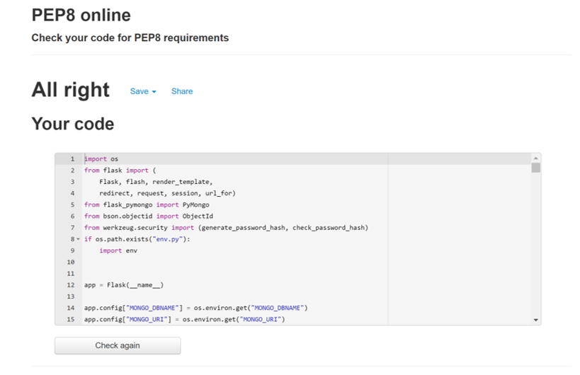
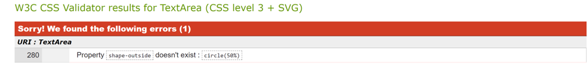
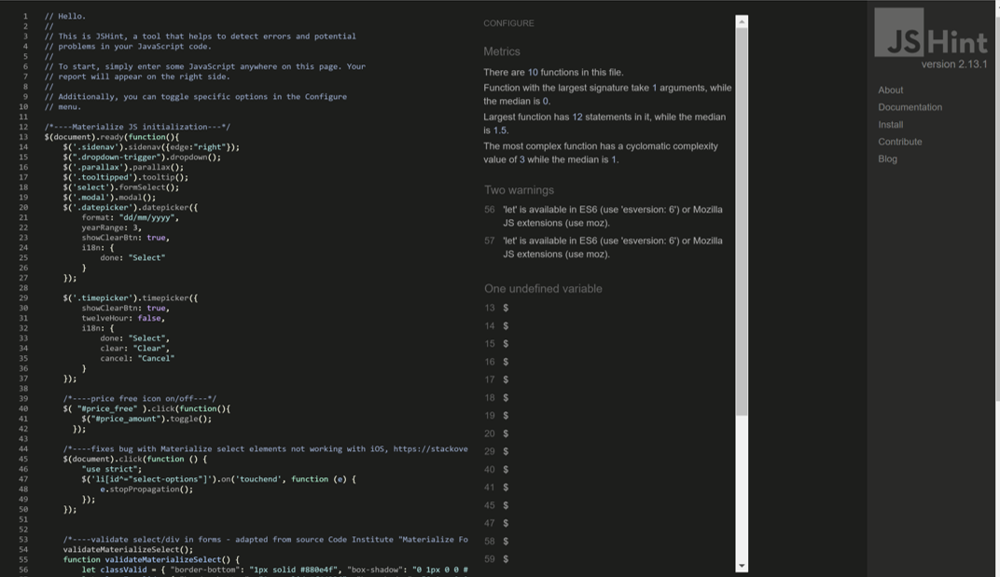

# Berries Nearby

## Testing

#### Website has been tested and corrected by: 
- http://pep8online.com/

- https://validator.w3.org/ - validating HTML content was showing errors because of Jinja expressions. When those are removed, the validation tests of all html pages are currently not showing any errors.

- https://jigsaw.w3.org/css-validator/ 

    - css validator is showing 1 error - not existing property, but this property is described well on [MDN](https://developer.mozilla.org/en-US/docs/Web/CSS/shape-outside) and well documented, therefore this error is ignored.

- https://www.jshint.com/

- https://www.freeformatter.com/html-formatter.html 

#### **Testing of features:**
Print screens of features may be found under mockups [here](MOCKUPS.md).
Testing and improving the application was carried out throughout its development.
Features were tested in Chrome, Mozzilla Firefox, Safari and Microsoft Edge for computer version, for touch screens, features were tested on Apple, Sony, Huawei and Xiaomi Redmi devices.

##### Testing User Stories from User Experience (UX): 
- If any user types in wrong URL, an error page 404 will be displayed.

#### First time user 
- Opens the website on home page, scrolls and reads around. The functionality "Register" may be opened either from Navigation bar or from purple area "Get started now". Both links lead to Register.html.
- After filling the form and submiting, user gets to page profile.html while receiving flash message "Registration Successful!". 
- In case the user has already signed up his account, there is a "helper" link under the submit button that leads to sign in page.
- First time user may later on behave similarily as "Second and more time user" therefore more is described below.
- all links tested, work well, documented under mockups section

#### Second and more time user 
1. **Farmer**
- Goes to the home page where opens link "sign in" from nav bar. 
- Signin.html - provides his/hers username and password and clicks on "sign in" button, after submitting, user opens page Profile.html and a flash message saying "Welcome! You are signed in as 'username'".
- Profile.html - displays all offers provided by the current signed in user. In case there are no offers published, user sees message "Currently no offers published."
- all links tested, work well, documented under mockups section

- Farmer may want to add (create) a new offer by clicking on Add offer (add_offer.html) from navigation
    - farmer sees a form with
        - 2 select fields to choose 
            - category of fruits (loads fruit_categories from database)
            - location (loads location from database)
        - date available for pick up - opens date picker (from Materialize)
        - 2 fields for available times - start and end, opens time picker (from Materialize)
        - description, equipment and contact are input fields
        - free of charge switch button (with tooltiped instructions for better understanding)
        - in case he/she decides to charge fruits, farmer may add the amount of price at Price number input
            - price elements are not required as it is either one or the other. In case these fields are left out, an automatic icon of "Free of charge" is attached to offer
        - when ready farmer clicks on "Publish offer", a flask message "Offer Successfully Added" appears and farmer is automaticaly transfered to page Current Offers (offers.html)
        - his/hers offer appears at the end of the list of offers
        - all links tested, work well, documented under mockups section

- Farmer may want to update his/hers offer that has been previously added
    - may do that from
        - profile.html page
        - offers.html page
    - edit is performed by clicking on "edit" icon on the offer card
    - clicking links to edit_offer.html
        - all fields are rendered from the database under the current offer id
    - farmer may cancel the editing byt clicking on button cancel or submit byt clicking on "edit offer"
    - a flash message appears saying "Offer Successfully Updated"
    - all links tested, work well, documented under mockups section

- Farmer may want to delete his/hers offer
    - may do that from
        - profile.html page
        - offers.html page 
    - delete is performed by clicking on "delete" icon on the offer card
    - click opens a modal asking whether user is sure about deleting the offer, options are "cancel" or "delete"
    - click on "delete" removes the offer from database and is no longer visible to any users
    - all links tested, work well, documented under mockups section

- Famer may want to see and read what others have to offer 
    - after sign in, a registered user may read all offers currently presented under link "Current offers" - offer.html
- Farmer may want to report another farmer, description below at "Customer"

2. **Customer**
- All users who decide not to post any of their own offers but are registered, have an access to read all current offers under "Current Offers" - offers.html
- A customer may report a farmer in case the customer gets impression some information are false or the farmer is behaving not trustworthy 
    - on page "Current offers" - offers.html each card of offers has an icon of exclamation mark in circle. By clicking on the icon a modal opens
    - modal contains
        - message of "Is there anything you want to let us know about this farmer? Please go ahead and we will proceed the query."
        - input field with label "Write Your Report"
        - submit and cancel button
    - after submitting, a flash message appears with text "offer reported, thank you".
    - report links tested, work well, documented under mockups section

2. **Admin**
- admin has all rights as a farmer and customer
- apart from the previous funcitonalities, admin has extended navigation bar with further roles
- **Manage categories**
    - in case Admin wants to edit the current categories, he/she opens the link "Manage categories" which leads to page "get_categories.html"
    - all current categories are displayed
        - each category provides icons with functions of
            - delete category
                - open modal window with text "Are you sure you want to delete this category?"
                - options are "cancel" and "delete" - removes fruit category from database
            - edit category
                - opens edit_category.html
                - current category is rendered from database and may be edited.
                - click on "cancel" or "edit category" - shows flash message "Category successfuly updated."
        - add new category
            - opens page add_category.html
            - alows admit to add new name of a category
            - click on "cancel" or "Add category" - when new category is added, it automaticaly contains the same buttons as the already existing ones
    -  all links tested, work well, documented under mockups section

- **Reports**
    - clicking on Reports opens reports.html with list of reported messages from users
    - each report displays the actual text of report, who reported the text and and option to "See details of this report"
    - clicking on "See details..." opens report_detail.html, Report detail page displays:
        - card with the actual offer and all information that is posted on "Current offers" so that admin may compare what could be wrong with the reported offer
        - card with reported text - the same as on report.html and username who reported the offer
        - more details about the farmer whose offer has been reported: 
            - Farmer's username, farmer's email, farmer's full name
        - currently there is not many actions provided for the admin to perform with the reports but as mentioned in ReadMe, left for future development
            - admin may click on button "Close report" and gets to page reports.html
            - button "Remove warning badge" is left for future development and currently is without functionality
    - all links tested, work well, documented under mockups section
